# 기아 PBV 기반 관광 모빌리티 서비스 (Tourism_Mobility)

> PBV의 공간 활용성과 디지털 콘텐츠를 결합해 이동 시간을 관광 경험으로 확장한 서비스 기획 프로젝트입니다.

## 프로젝트 개요

- **진행 기간:** 2024.12 – 2025.02
- **형태:** 2~3인 팀 공모전 프로젝트
- **담당 역할:** PBV 공간 활용, 관광 서비스 흐름 및 문화 콘텐츠 제공 방식 기획
- **프로젝트 범위:** 서비스 기획, 사용자 시나리오, 차량 공간 및 디스플레이 UX 설계

> 본 저장소는 개인 포트폴리오 목적으로 프로젝트의 공개 가능한 내용만 정리했습니다.  
> 기아의 공식 제품이나 상용 서비스를 의미하지 않습니다.


## 팀 구성 및 역할

본 프로젝트는 총 3명이 함께 진행한 팀 공모전 프로젝트입니다.  
팀원 모두 PBV 특성 분석, 서비스 아이디어 구체화, 사용자 시나리오 구성 및 발표 자료 제작에 참여했습니다.

<table>
  <thead>
    <tr>
      <th width="120">팀원</th>
      <th>담당 역할</th>
    </tr>
  </thead>
  <tbody>
    <tr>
      <td align="center"><b>이준호</b></td>
      <td>
        PBV 가변형 공간을 활용한 관광 서비스 아이디어 구체화,
        관광객 중심의 서비스 이용 흐름 및 사용자 시나리오 설계,
        공유·개인 디스플레이 기반 문화 콘텐츠 제공 방식 기획,
        지역 관광 정보 연계 방안 제안
      </td>
    </tr>
    <tr>
      <td align="center"><b>이승찬</b></td>
      <td>
        기아 PBV의 특징과 활용 사례 조사,
        관광객 이동 과정의 불편 요소 분석,
        차량 내부 공간 및 좌석 활용 아이디어 구체화,
        서비스 현실성과 확장 가능성 검토
      </td>
    </tr>
    <tr>
      <td align="center"><b>이동규</b></td>
      <td>
        관광지·문화재 콘텐츠와 주변 편의시설 정보 구성,
        디스플레이 사용자 경험 및 주요 기능 정리,
        서비스 흐름도와 발표 자료 구성,
        프로젝트 결과물 시각화 및 발표 준비
      </td>
    </tr>
  </tbody>
</table>

## 문제 정의

기존 관광 이동 서비스는 목적지까지의 운송에 집중되어 있어, 이동 시간이 관광 경험과 단절되는 문제가 있습니다.

본 프로젝트는 PBV의 넓은 실내 공간과 디스플레이를 활용해 이동 중에도 관광지의 역사·문화 정보를 경험할 수 있는 이동형 관광 체험 공간을 제안했습니다.

### 협업 방식

- PBV 및 관광 모빌리티 관련 사례를 공동 조사
- 아이디어 회의를 통해 핵심 사용자와 서비스 이용 상황을 정의
- 차량 탑승부터 관광지 도착까지의 사용자 경험 흐름을 함께 설계
- 공간 구성, 디스플레이 기능 및 관광 콘텐츠를 하나의 서비스로 통합
- 역할별 결과물을 공유하고 피드백하면서 최종 기획안과 발표 자료 완성

## 핵심 제안

### 이동형 관광 체험 공간

- 4인 중심의 대화형 좌석 구조
- 관광지와 문화재 사전 콘텐츠 제공
- 이동 경험과 현장 관광 경험 연결

### 공동 경험과 개인 맞춤 기능

- 공유 디스플레이를 통한 문화·관광 콘텐츠 시청
- 개인 패드를 통한 언어 및 관광 코스 선택
- 좌석, 냉난방, 조명 등 차량 환경 제어

### 지역 관광 생태계 연계

- 전통시장, 음식점, 카페 및 숙박시설 추천
- 관광지 방문을 지역 상권과 생활문화 경험으로 확장
- 대형 짐을 위한 루프 리프트 및 실내 공간 최적화

## 사용자 경험 흐름

1. 관광객이 언어와 여행 코스를 선택합니다.
2. 차량 이동 중 목적지의 역사·문화 콘텐츠를 시청합니다.
3. 개인 패드로 좌석과 차량 환경을 조절합니다.
4. 목적지 주변의 음식점과 편의시설을 추천받습니다.
5. 사전 정보와 현장 관광 경험을 연결합니다.

## 주요 설계
### 저장소 구조

```text
kia-pbv-tourism-mobility/
├── README.md
└── assets/
    ├── vehicle-exterior.png
    ├── interior-layout.png
    ├── shared-display-retracted.png
    ├── shared-display-deployed.png
    ├── shared-display-active.png
    ├── personal-display-overview.png
    ├── personal-display-detail.png
    ├── rear-seats-folded.png
    ├── rear-seats-deployed.png
    ├── rotating-front-seats.png
    ├── roof-lift-closed.png
    └── roof-lift-open.png
```

### 차량 외관 및 내부 공간

<p align="center">
  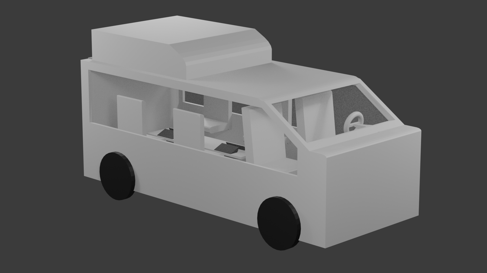
  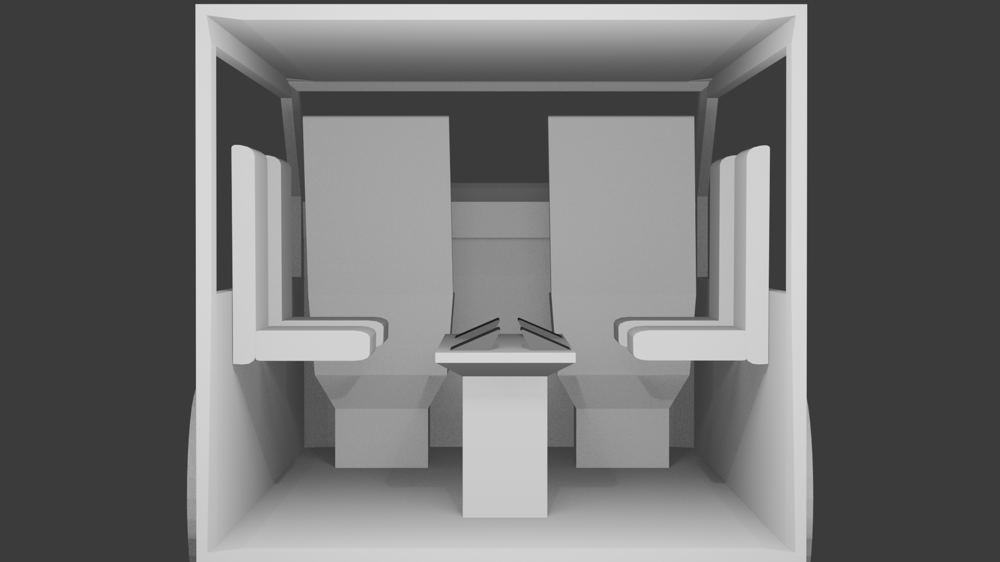
</p>

<p align="center">
  <sub>차량 외관과 4인 중심의 실내 공간 구성</sub>
</p>

---

### 공유 디스플레이 수납 및 전개

<p align="center">
  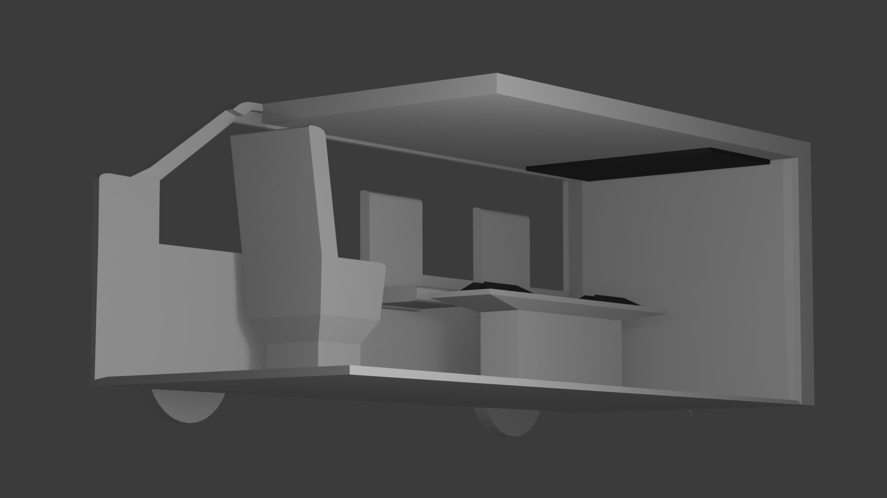
  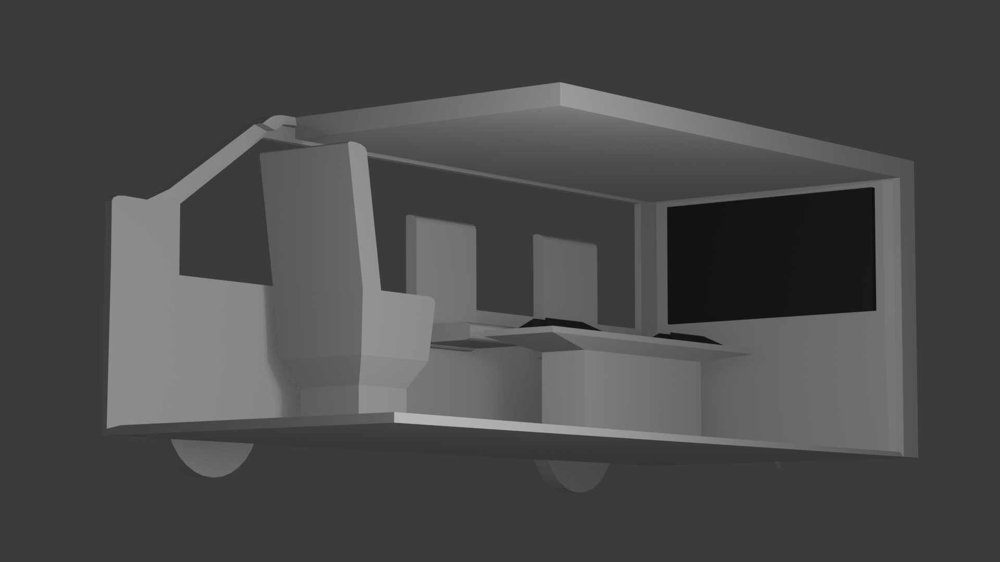
</p>

<p align="center">
  <sub>공유 디스플레이 수납 상태(왼쪽)와 전개 상태(오른쪽)</sub>
</p>

---

### 공유 및 개인 디스플레이

<p align="center">
  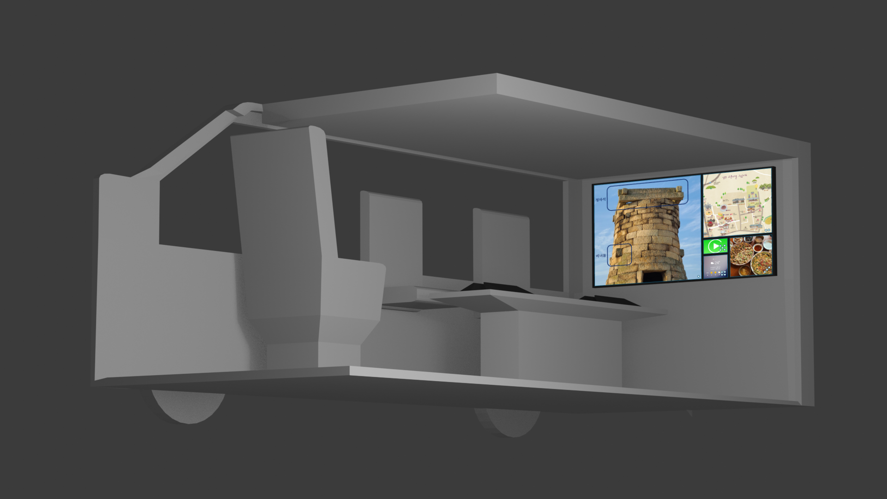
  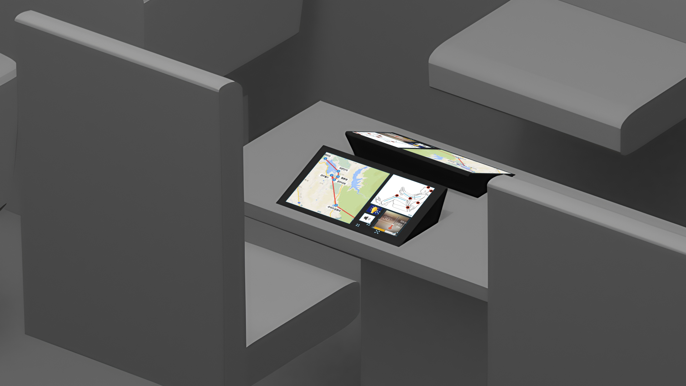
</p>

<p align="center">
  <sub>공동 관광 콘텐츠와 개인 맞춤형 차량 제어 화면</sub>
</p>

---

### 개인 디스플레이 배치

<p align="center">
  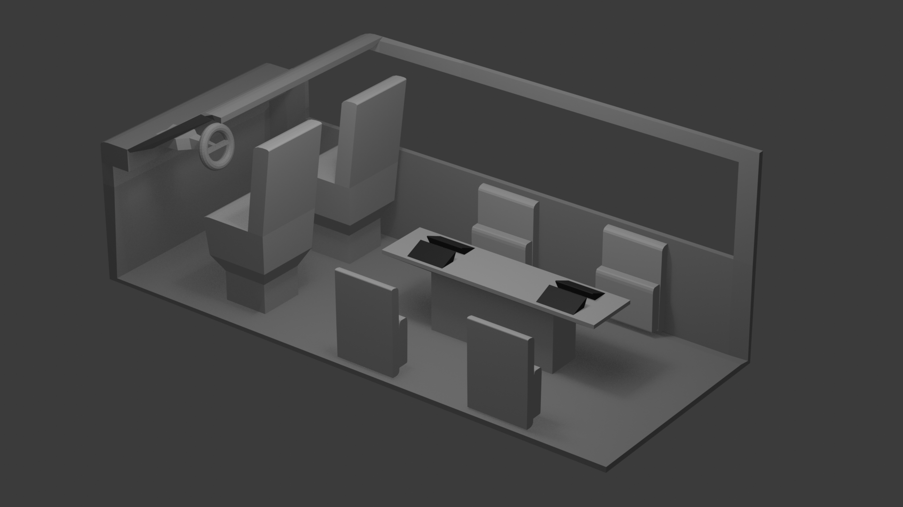
  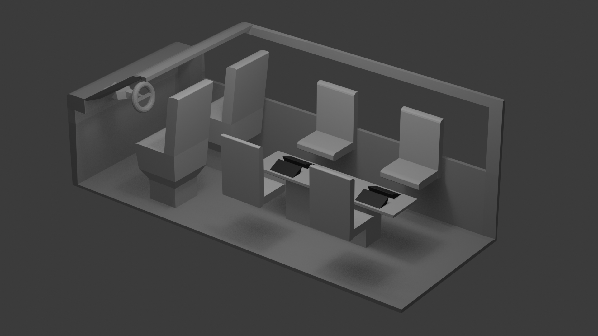
</p>

<p align="center">
  <sub>좌석별 개인 디스플레이와 가변형 실내 좌석 구조</sub>
</p>

---

### 가변형 뒷좌석

<p align="center">
  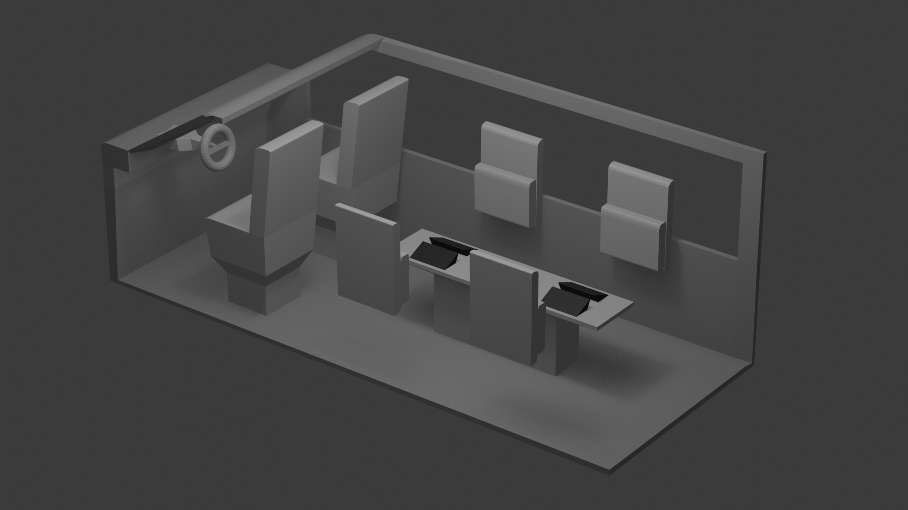
  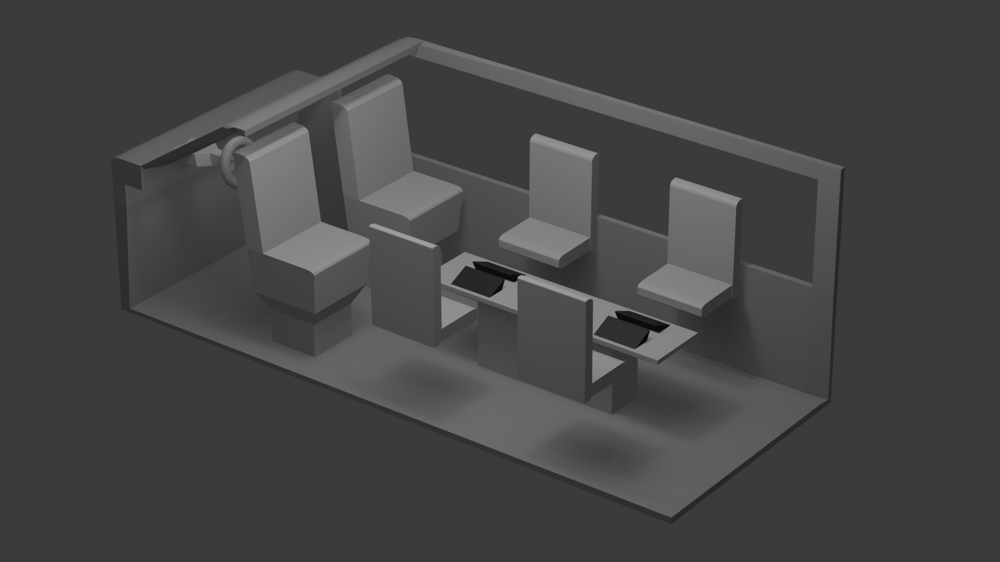
</p>

<p align="center">
  <sub>뒷좌석 수납 상태(왼쪽)와 전개 상태(오른쪽)</sub>
</p>

---

### 루프 리프트

<p align="center">
  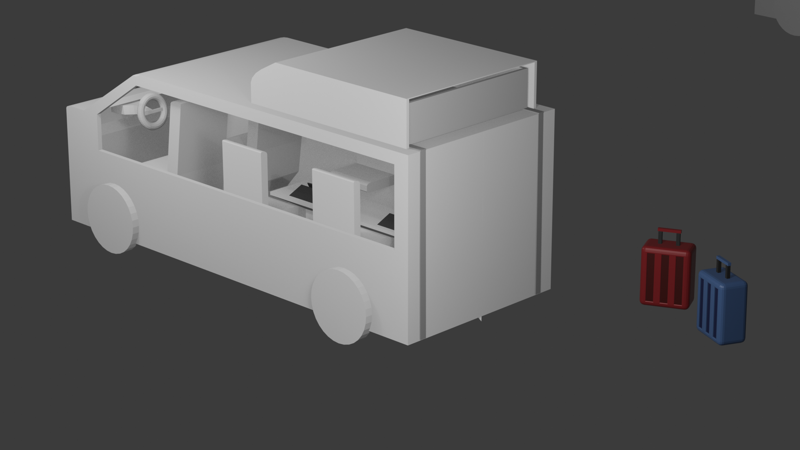
  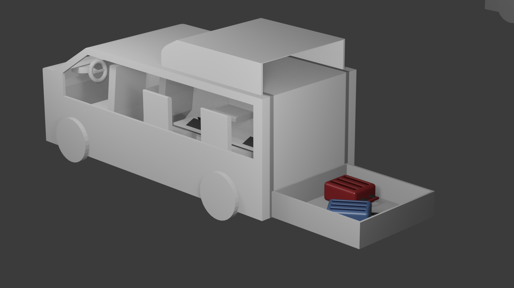
</p>

<p align="center">
  <sub>루프 리프트 수납 상태(왼쪽)와 짐 적재 상태(오른쪽)</sub>
</p>

## 개인 기여

- PBV의 가변형 공간을 활용한 관광 서비스 아이디어 구체화
- 관광객 중심의 서비스 이용 흐름과 사용자 시나리오 설계
- 공유 디스플레이와 개인 관광 가이드 패드 기능 기획
- 이동 중 문화 콘텐츠 제공 방식과 지역 관광 정보 연계 기획
- 팀 기획 회의 및 발표 자료 제작 참여

## 프로젝트를 통해 배운 점

- 차량 플랫폼의 기술적 특징을 사용자 경험과 연결하는 방법
- 이동 과정 전체를 기준으로 사용자 문제와 요구사항을 분석하는 방법
- 기술 구현 가능성, 사용자 편의성 및 서비스 확장성을 함께 고려하는 방법
- AI·SW 기술을 실제 서비스 가치로 연결하기 위한 기획의 중요성
